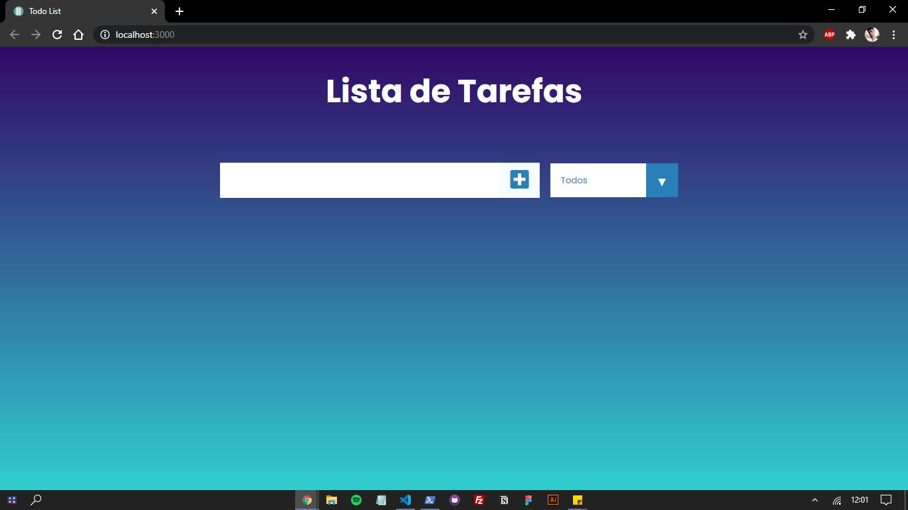
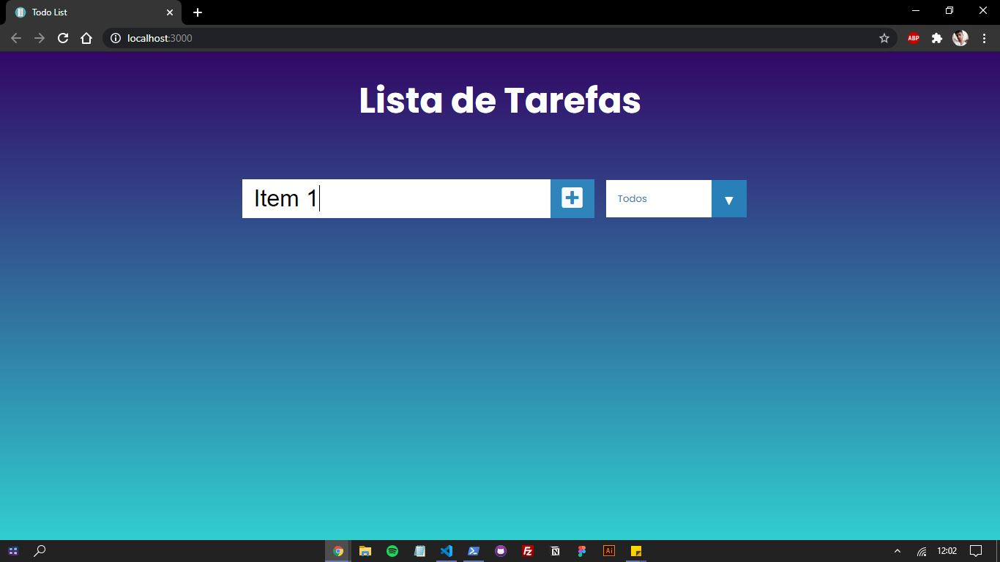
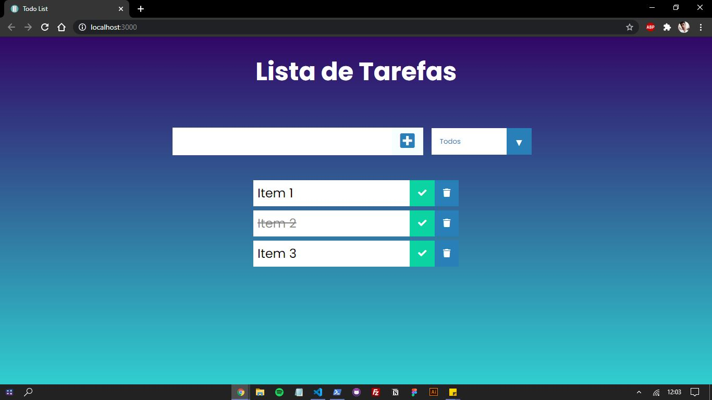
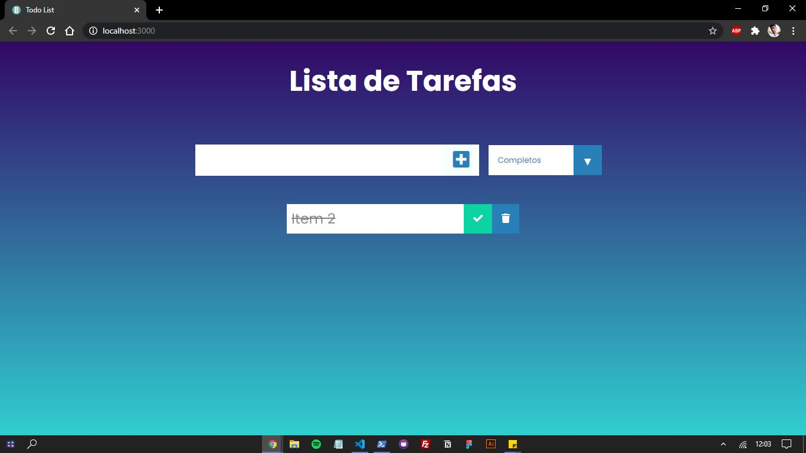
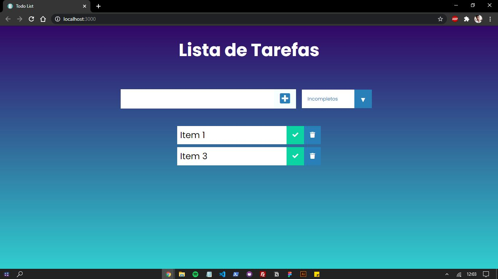

<h1 align="center">Todo List<h1>

## Descrição ✍️

  App desenvolvido com reactjs para fazer uma lista de tarefas. Utilizando os filtros podemos separar as tarefas completas das incompletas, que quando criadas, são salvas usando local storage.

&nbsp;

  
  
  
  
  
  

 <a href="#tecnologias">Tecnologias</a> •
 <a href="#features">Features</a> •
 <a href="#run">Run</a> •
 <a href="#autor">Autor</a>

&nbsp;
## Tecnologias 👩‍💻

 
 - HTML
 &nbsp;
 - CSS
 &nbsp;
 - JS
 &nbsp;
 - ReactJS

&nbsp;
## Features 🆕

  ✅ Filtro entre as tarefas
  &nbsp;

&nbsp;
## Run 🏁

  1º Para rodar o projeto é necessário instalar todas as dependências, e para isso basta executar o comando `npm install`.
  &nbsp;

  2º Afim de iniciar o servidor, após instalar as depencências, execute o comando `yarn start` no terminal.
  &nbsp;

  3º Após isso, no seu navegador, abra o endereço `http://localhost:3000/` para vizualizar o prjeto.

&nbsp;
## Autor
<a style="text-decoration: none;" href="https://github.com/olagregs">
  
  
Gregory Ferreira 💻

</a>

Made with ❤️ and ☕ by me 😁

&nbsp;